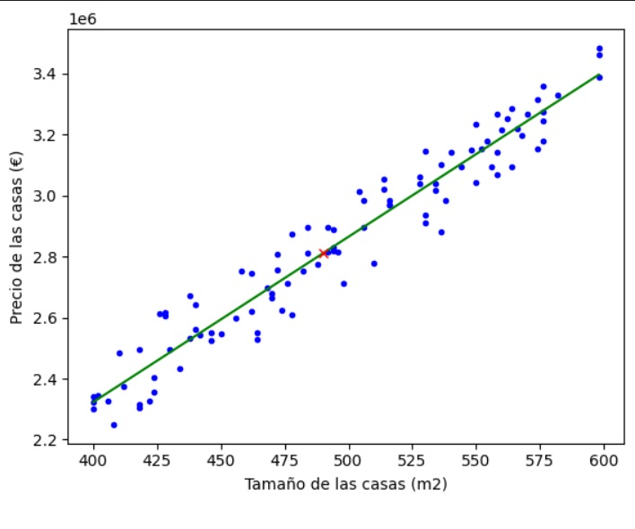

# Regresion Lineal


Este proyecto implementa un modelo de regresión lineal para predecir el precio de las casas basándose en su tamaño (metros cuadrados). Utilizamos un conjunto de datos generado aleatoriamente con la librería NumPy. El objetivo principal es comprender cómo se puede emplear la regresión lineal en la predicción de precios, teniendo en cuenta que los datos utilizados son simulados y no reflejan condiciones del mercado real.

> [!IMPORTANT]
Este proyecto es de carácter educativo y sirve para entender los conceptos básicos de la regresión lineal. Los modelos y los datos generados son hipotéticos y no deben utilizarse para aplicaciones reales sin una validación y ajuste adecuados.

## 💻 Funcionalidad
El script principal realiza las siguientes operaciones:
1. Genera un conjunto de datos aleatorios para tamaños y precios de casas.
2. Entrena un modelo de regresión lineal con estos datos.
3. Realiza predicciones de precios basadas en el tamaño de la casa.
4. Visualiza los datos y la línea de regresión.

## 📂 Estructura del proyecto
```
├── LICENSE
├── README.md
└── Regresion_Lineal.ipynb
```

## 📝 Contribuciones
Las contribuciones son bienvenidas. Si deseas contribuir al proyecto, por favor haz un 'fork' del repositorio, crea una rama con tus mejoras y envía un 'pull request'.

## 📄 Licencia
Este proyecto está bajo una licencia MIT. Consulta el archivo LICENSE para más detalles.
